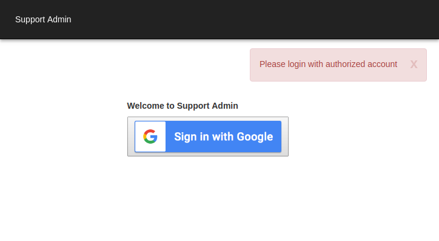
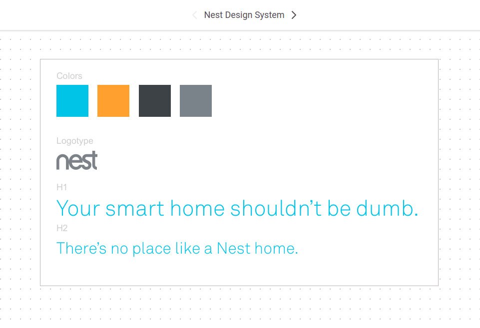
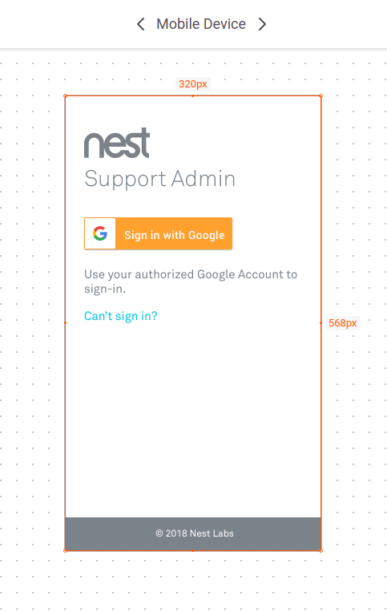
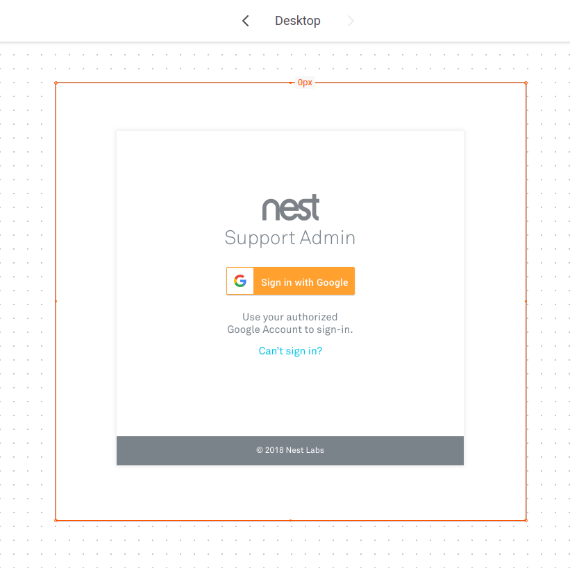
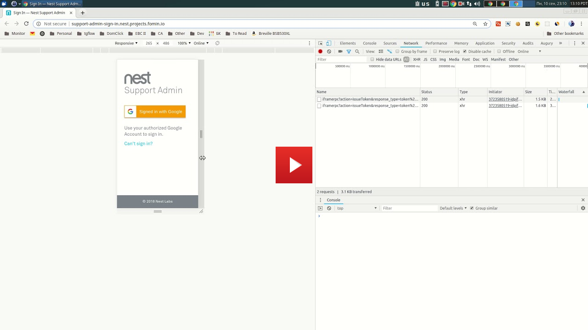
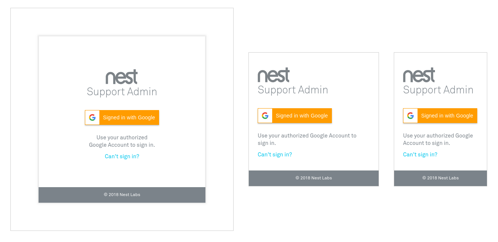

# Nest Support Admin Sign In Redesign

## Task Description

The task was to redesign the Nest Support Admin sign in page
and to make sure that it works even inside of an iframe.

## Prerequisites

Unfortunately, I didn't have access to the Nest brand book or any style guides,
so I have had to derive the design guidelines from the [Nest homepage](https://nest.com/)
directly by myself.

The fonts were also unavailable, so I've dug through the page source to find
the fonts used and then spent some time to find any downloadable versions on the Internet.

## Design Guidelines

I've analyzed the Nest homepage in order to extract design guidelines,
assets, colors, and fonts from it.

During the process, I've found out that the homepage styles are not very much
consistent in the first place. However, I've managed to extract all basic properties
and captured them in a very minimalistic Sketch document:

## Interface Design

Based on the previous analysis, and using obtained assets, I've started to work
on actual designs of the user interface in Sketch.

According to the best practices I've decided to use the mobile-first approach
and selected the `320x568` resolution as a basis for the mobile version.
By adapting the design to this resolution I've made sure that UI would be usable
even on small low-end and outdated (but still popular) devices.

I wanted the design to be single goal purposed and therefore minimalistic:

### Header

I've used the Nest logo and a prominent heading to clearly connect the
sign-in UI screen with the brand and the whole application itself.
The `Akkurat Light` font was used for the heading, but I've decided to use
the grey color instead of the cyan one, so it wouldn't distract the user so much.

### Sign In Button

I also wanted the sign in button to be the most prominent element on the page,
so I've used the orange color to clearly distinguish it from the rest of the elements.
I've studied the Google [Sign In Branding Guidelines][sign-in-branding-guidelines]
in order to figure out what aspects of the button could be customized and
what would be the correct way to do it.

### Text With the Link

I've also added a text to even more clearly describe the purpose of the page and
to explicitly identify what action the user is expected to do. Also, this text
could serve as an accessibility feature for users who are using screen readers.

And the `Can't sign in?` link is there to handle the cases where users are unable
to log in for some reason. It should lead to some sign in troubleshooting guide and
probably contain some immediate contacts the user could use.

### Footer

The footer is there for completeness  (both visual and functional). It contains the
copyright information but could be extended to contain some useful links and
legal information. 

## Desktop Design Version

When it came to the desktop version of the design, I've decided to put the interface
into a square box in the centre of the screen in order to make it stand out more and
to focus the user's attention on it. It really helped to visually separate the
interface from the wast space of the blank desktop screen:

The elements orientation is changed to be centrally aligned in order to cope with the
overall centering of the entire interface layout.

## Implementation

### HTML

I've used the semantic HTML5 elements to create a structure for the interface.
The BEM notation was used to connect the HTML and CSS together into a cohesive system.

### Styles

All styles were written using SASS Framework (SCSS format) and were separated into
various reusable modules. The details of the design system (like colors) were extracted
into reusable SASS variables and mixins.

Downloaded fonts were converted into WOFF and WOFF2 formats and were also imported to
the project.

SASS Lint is used to perform development-time SCSS code linting and to make sure
that code is using the best practices, code styles and doesn't contain other issues.

PostCSS, Browserslist, and Normalize.css are used together to automatically generate
the normalization CSS rules to counter inconsistencies for the latest 2 versions
of all modern browsers. This is used as a replacement for so-called CSS resets.

### JavaScript

Small JavaScript file was also written in order to install
the Google Sign In Button to the page using Google Cloud Platform's API.

All JavaScript is coded in ES2015 format and later transpiled
to the ES5 using Webpack and Babel.

### Bundling

The webpack configuration was created to hold the project together and to bundle everything
as a final ready to use application. The development mode with live reloading was also
set up in order to make the development process more optimal.

### Responsiveness

The interface is first implemented using styles for mobile devices and then
additional styles are added via media queries to override some aspects in order
to handle the desktop cases as well.

Two nested breakpoints are actually used to support the desktop layout.

All edge cases are thoroughly studied in order to make the interface truly
bulletproof. It should be correctly rendered on almost any resolution and in case,
where vertical space is not available, the user could use the scrollbar to actually
access all the content ensuring the maximum usability across all the devices.

Also, some words like the `sign in` are specifically added to a common container
element with `white-space: nowrap;` in order to prevent splitting such words in the
case where wrapping occurs.

Also, the conditional ` ` element is added to the text in order to force it
to split into two lines on the desktop layout where a single long line would
look weird.

#### Responsiveness Demonstration Video

### Iframe Support

Due to the flexible and highly responsive nature of the interface, it could be used
inside of iframe of any size:

- See the live iframes test: https://jsfiddle.net/slavafomin/38rt6jaz/

## To Do

### Loading Animation

A preliminary evaluation showed that Google Sign In Button widget is not so quick to load,
especially if you are working on a slow mobile network with high latency. The interface
could be made more user-friendly by showing the loading animation while the button is being
initialized.

### Hiding Nest Logo

When the interface is used inside some other application where Nest logotype is already
present it would be redundant to show the Nest logo in this UI too.

An ability to hide the logo from the sign in screen could also be implemented for
such use cases.

### Keyboard Navigation

For some reason, the Google Button is not receiving focus when navigating by the keyboard.
It should be fixed in order to make the interface more usable for users with
accessibility issues.

## Live Demo

- http://support-admin-sign-in.nest.projects.fomin.io/

## Issues

- The Google Sign In Button is not always rendered.
  Probably, there is some racing condition there. It needs to be debugged further.
  I didn't have enough time to configure Webpack to properly control
  the order of scripts execution.
  
## Time Spent

It took me around 10 hours to complete the project starting from task analysis and
finishing with coding it from scratch, documenting and deploying it.

  [sign-in-branding-guidelines]: https://developers.google.com/identity/branding-guidelines
